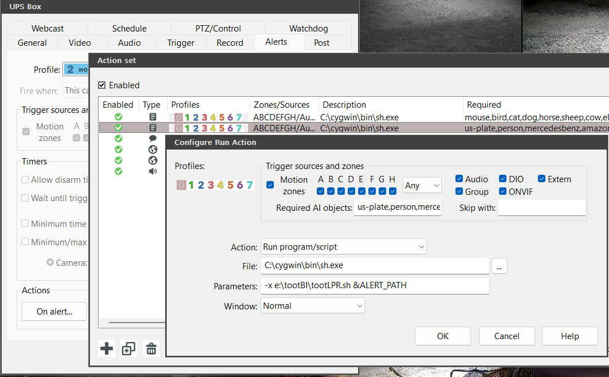

# tootLPR
Simple script to be called from Blue Iris which marks up image with detections and toots the result along with found plates

## Set up software
[Install Cygwin](https://www.cygwin.com/)
It might not be technically needed but Blue Iris seemed to have issues running python directly.

[Install Python. I used 3.10](https://www.python.org/downloads/)

### Run the following from a command window:

python.exe -m pip install --upgrade pip

pip install Image

pip install datetime

pip install requests

pip install toot

toot login --instance [host name]

** Note be sure to login as the user that will be running the script. In the case of Blue Iris this is generally the Administrator account. **

## Configure
Edit the paths in toolLPR.sh and tootLPRtest.bat

Edit the URLs to the AI servers in cfg.py

## Test setup

Run tootLPRtest.bat

## Set up Blue Iris

On the camera's **Alert** tab click on **On Alert**

On the **Alert Set** dialog create a set to **Run a script**

### Fill these fields

**Required AI Objects** Will call the script if any of theses objects are detected.

**File** Full path the the sh command

**Parameters** full path to tootLPR.sh followed with **&ALERT_PATH**

**&ALERT_PATH** is replaced with the image file name by Blue Iris